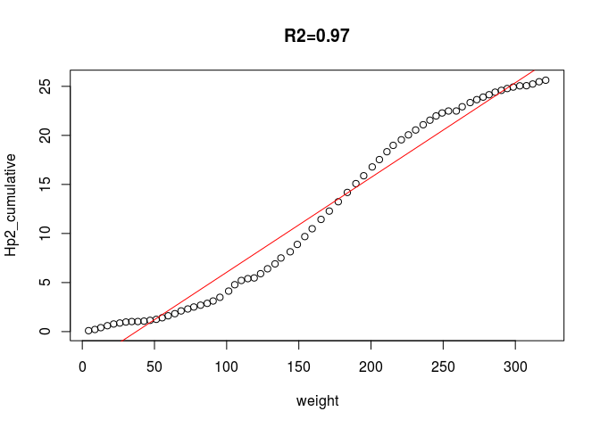
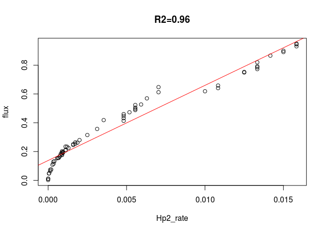
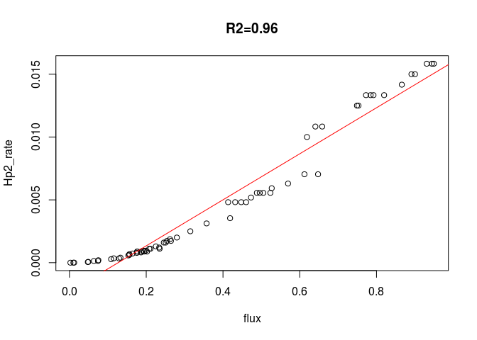
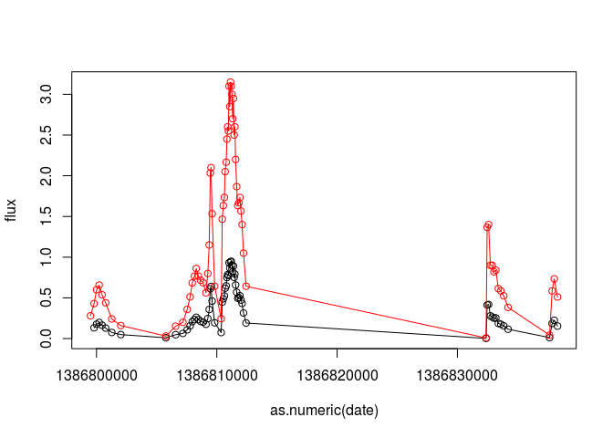

Rate calculation example
========================

This is an R script of a reproducible example for mass aggregation of scientific data, as described in -

> "Robust mass aggregation-based bedload flux prediction in flash flood conditions using an acoustic sensor" by Eran Halfi, Dror Paz, Kyle Stark, Ian Reid, Michael Dorman, Jonathan B. Laronne

Usage: replace the sample CSV file `bedload_mass_calibration_example.csv` file with a different one, following this structure.

    ##                  date   weight level  Hp
    ## 1 2013-12-11 23:58:00 0.029397   0.0 0.0
    ## 2 2013-12-11 23:58:30 0.271035   0.2 0.1
    ## 3 2013-12-11 23:59:00 0.626709   0.4 0.1
    ## 4 2013-12-11 23:59:30 1.008832   0.4 0.1
    ## 5 2013-12-12 00:00:00 1.303752   0.3 0.1
    ## 6 2013-12-12 00:00:30 1.673890   0.4 0.1

Reading data
------------

``` r
# Read file
dat = read.csv("bedload_mass_calibration_example.csv", skip = 1, stringsAsFactors = FALSE)
head(dat)
```

    ##             Date.time    LC.kg LC.change.kg LC.flux..30.s..kg.sm d.cm
    ## 1 12/11/2013 23:58:00 0.029397          0.0                  0.0 56.9
    ## 2 12/11/2013 23:58:30 0.271035          0.2                  0.1 56.7
    ## 3 12/11/2013 23:59:00 0.626709          0.4                  0.1 56.7
    ## 4 12/11/2013 23:59:30 1.008832          0.4                  0.1 56.8
    ## 5 12/12/2013 00:00:00 1.303752          0.3                  0.1 56.7
    ## 6 12/12/2013 00:00:30 1.673890          0.4                  0.1 56.7
    ##   US1.pulses X1kg.sum X1kg.index  X X1kg.index.1             X.1 LC.kg.1
    ## 1        295      0.0          1 NA            1 12/12/2013 0:00    1.30
    ## 2        255      0.2          1 NA            2 12/12/2013 0:02    2.49
    ## 3        272      0.6          1 NA            3 12/12/2013 0:04    3.65
    ## 4        221      1.0          1 NA            4 12/12/2013 0:05    4.66
    ## 5        230      1.3          1 NA            5 12/12/2013 0:07    5.90
    ## 6        274      0.4          2 NA            6 12/12/2013 0:08    7.25
    ##   LC.change.kg.1 LC.flux.kg.sm L7.cm US1.pulses.1
    ## 1           0.00                   0            0
    ## 2           1.19          0.09     0            0
    ## 3           1.15          0.09     0            0
    ## 4           1.01          0.10     0            0
    ## 5           1.25          0.13     0            0
    ## 6           1.35          0.14     0            0

``` r
# Selecting relevant columns
dat = data.frame(
  date = dat[, 1],
  weight = dat[, 2],
  level = dat[, 3],
  Hp = dat[, 4]
)
head(dat)
```

    ##                  date   weight level  Hp
    ## 1 12/11/2013 23:58:00 0.029397   0.0 0.0
    ## 2 12/11/2013 23:58:30 0.271035   0.2 0.1
    ## 3 12/11/2013 23:59:00 0.626709   0.4 0.1
    ## 4 12/11/2013 23:59:30 1.008832   0.4 0.1
    ## 5 12/12/2013 00:00:00 1.303752   0.3 0.1
    ## 6 12/12/2013 00:00:30 1.673890   0.4 0.1

``` r
# Filtering empty incomplete rows
dat = dat[complete.cases(dat), ]

# Formatting date-time
dat$date = as.POSIXlt(paste0(dat$date, ".00"), format = "%m/%d/%Y %H:%M:%S") 
```

Rate calculation
----------------

``` r
# Set threshold
threshold = 4

# Consecutive differences
dat$change = c(0, diff(dat$weight))
head(dat)
```

    ##                  date   weight level  Hp   change
    ## 1 2013-12-11 23:58:00 0.029397   0.0 0.0 0.000000
    ## 2 2013-12-11 23:58:30 0.271035   0.2 0.1 0.241638
    ## 3 2013-12-11 23:59:00 0.626709   0.4 0.1 0.355674
    ## 4 2013-12-11 23:59:30 1.008832   0.4 0.1 0.382123
    ## 5 2013-12-12 00:00:00 1.303752   0.3 0.1 0.294920
    ## 6 2013-12-12 00:00:30 1.673890   0.4 0.1 0.370138

``` r
# Cumulative differences, reset when threshold passed
dat$cumulative = NA
dat$cumulative[1] = 0
for(i in 2:nrow(dat)) {
  dat$cumulative[i] = ifelse(
    dat$cumulative[i-1] >= threshold, 
    dat$change[i], 
    dat$change[i] + dat$cumulative[i-1] 
    )
}
head(dat)
```

    ##                  date   weight level  Hp   change cumulative
    ## 1 2013-12-11 23:58:00 0.029397   0.0 0.0 0.000000   0.000000
    ## 2 2013-12-11 23:58:30 0.271035   0.2 0.1 0.241638   0.241638
    ## 3 2013-12-11 23:59:00 0.626709   0.4 0.1 0.355674   0.597312
    ## 4 2013-12-11 23:59:30 1.008832   0.4 0.1 0.382123   0.979435
    ## 5 2013-12-12 00:00:00 1.303752   0.3 0.1 0.294920   1.274355
    ## 6 2013-12-12 00:00:30 1.673890   0.4 0.1 0.370138   1.644493

``` r
# Mark change points
dat$index = dat$cumulative > threshold
head(dat)
```

    ##                  date   weight level  Hp   change cumulative index
    ## 1 2013-12-11 23:58:00 0.029397   0.0 0.0 0.000000   0.000000 FALSE
    ## 2 2013-12-11 23:58:30 0.271035   0.2 0.1 0.241638   0.241638 FALSE
    ## 3 2013-12-11 23:59:00 0.626709   0.4 0.1 0.355674   0.597312 FALSE
    ## 4 2013-12-11 23:59:30 1.008832   0.4 0.1 0.382123   0.979435 FALSE
    ## 5 2013-12-12 00:00:00 1.303752   0.3 0.1 0.294920   1.274355 FALSE
    ## 6 2013-12-12 00:00:30 1.673890   0.4 0.1 0.370138   1.644493 FALSE

``` r
# Cumulative 'level' and 'Hp', with reset at change points
dat$level2 = NA
dat$Hp2 = NA
dat$Hp2_sum = NA
steps = which(dat$index)
for(i in 1:length(steps)) {
  if(i == 1) {w = 0:steps[i]} else {w = (steps[i-1]+1):steps[i]}  # Window to average
  dat$level2[steps[i]] = mean(dat$level[w])
  dat$Hp2[steps[i]] = mean(dat$Hp[w])
  dat$Hp2_sum[steps[i]] = sum(dat$Hp[w])
}
head(dat)
```

    ##                  date   weight level  Hp   change cumulative index level2
    ## 1 2013-12-11 23:58:00 0.029397   0.0 0.0 0.000000   0.000000 FALSE     NA
    ## 2 2013-12-11 23:58:30 0.271035   0.2 0.1 0.241638   0.241638 FALSE     NA
    ## 3 2013-12-11 23:59:00 0.626709   0.4 0.1 0.355674   0.597312 FALSE     NA
    ## 4 2013-12-11 23:59:30 1.008832   0.4 0.1 0.382123   0.979435 FALSE     NA
    ## 5 2013-12-12 00:00:00 1.303752   0.3 0.1 0.294920   1.274355 FALSE     NA
    ## 6 2013-12-12 00:00:30 1.673890   0.4 0.1 0.370138   1.644493 FALSE     NA
    ##   Hp2 Hp2_sum
    ## 1  NA      NA
    ## 2  NA      NA
    ## 3  NA      NA
    ## 4  NA      NA
    ## 5  NA      NA
    ## 6  NA      NA

``` r
# Remove all rows which do not comprise change points
dat = dat[dat$index, c("date", "weight", "level2", "Hp2", "Hp2_sum")]
head(dat)
```

    ##                   date    weight    level2        Hp2 Hp2_sum
    ## 15 2013-12-12 00:05:00  4.343797 0.2800000 0.09333333     1.4
    ## 25 2013-12-12 00:10:00  8.726854 0.4300000 0.12000000     1.2
    ## 32 2013-12-12 00:13:30 12.801539 0.6000000 0.18571429     1.3
    ## 39 2013-12-12 00:17:00 17.384831 0.6571429 0.20000000     1.4
    ## 47 2013-12-12 00:21:00 21.723185 0.5375000 0.17500000     1.4
    ## 57 2013-12-12 00:26:00 25.989743 0.4400000 0.10000000     1.0

``` r
# Cumulative Hp2
dat$Hp2_cumulative = cumsum(dat$Hp2)
head(dat)
```

    ##                   date    weight    level2        Hp2 Hp2_sum
    ## 15 2013-12-12 00:05:00  4.343797 0.2800000 0.09333333     1.4
    ## 25 2013-12-12 00:10:00  8.726854 0.4300000 0.12000000     1.2
    ## 32 2013-12-12 00:13:30 12.801539 0.6000000 0.18571429     1.3
    ## 39 2013-12-12 00:17:00 17.384831 0.6571429 0.20000000     1.4
    ## 47 2013-12-12 00:21:00 21.723185 0.5375000 0.17500000     1.4
    ## 57 2013-12-12 00:26:00 25.989743 0.4400000 0.10000000     1.0
    ##    Hp2_cumulative
    ## 15     0.09333333
    ## 25     0.21333333
    ## 32     0.39904762
    ## 39     0.59904762
    ## 47     0.77404762
    ## 57     0.87404762

``` r
# Calculate flux
dat$change = c(NA, diff(dat$weight))
dat$difftime = c(NA, as.numeric(diff(as.POSIXlt(dat$date)), unit = "secs"))
dat$flux = (dat$change / 0.11) / dat$difftime
head(dat)
```

    ##                   date    weight    level2        Hp2 Hp2_sum
    ## 15 2013-12-12 00:05:00  4.343797 0.2800000 0.09333333     1.4
    ## 25 2013-12-12 00:10:00  8.726854 0.4300000 0.12000000     1.2
    ## 32 2013-12-12 00:13:30 12.801539 0.6000000 0.18571429     1.3
    ## 39 2013-12-12 00:17:00 17.384831 0.6571429 0.20000000     1.4
    ## 47 2013-12-12 00:21:00 21.723185 0.5375000 0.17500000     1.4
    ## 57 2013-12-12 00:26:00 25.989743 0.4400000 0.10000000     1.0
    ##    Hp2_cumulative   change difftime      flux
    ## 15     0.09333333       NA       NA        NA
    ## 25     0.21333333 4.383057      300 0.1328199
    ## 32     0.39904762 4.074685      210 0.1763933
    ## 39     0.59904762 4.583292      210 0.1984109
    ## 47     0.77404762 4.338354      240 0.1643316
    ## 57     0.87404762 4.266558      300 0.1292896

``` r
# Caculate Hp rate
dat$Hp2_rate = dat$Hp2 / dat$difftime
head(dat)
```

    ##                   date    weight    level2        Hp2 Hp2_sum
    ## 15 2013-12-12 00:05:00  4.343797 0.2800000 0.09333333     1.4
    ## 25 2013-12-12 00:10:00  8.726854 0.4300000 0.12000000     1.2
    ## 32 2013-12-12 00:13:30 12.801539 0.6000000 0.18571429     1.3
    ## 39 2013-12-12 00:17:00 17.384831 0.6571429 0.20000000     1.4
    ## 47 2013-12-12 00:21:00 21.723185 0.5375000 0.17500000     1.4
    ## 57 2013-12-12 00:26:00 25.989743 0.4400000 0.10000000     1.0
    ##    Hp2_cumulative   change difftime      flux     Hp2_rate
    ## 15     0.09333333       NA       NA        NA           NA
    ## 25     0.21333333 4.383057      300 0.1328199 0.0004000000
    ## 32     0.39904762 4.074685      210 0.1763933 0.0008843537
    ## 39     0.59904762 4.583292      210 0.1984109 0.0009523810
    ## 47     0.77404762 4.338354      240 0.1643316 0.0007291667
    ## 57     0.87404762 4.266558      300 0.1292896 0.0003333333

Graphics
--------

``` r
# Plot 1
fit = lm(Hp2_cumulative ~ weight, dat)
s = summary(fit)
title = paste0("R2=", round(s$adj.r.squared, 2))
plot(Hp2_cumulative ~ weight, dat, main = title)
abline(fit, col = "red")
```



``` r
# Plot 2
fit = lm(flux ~ Hp2_rate, dat)
s = summary(fit)
title = paste0("R2=", round(s$adj.r.squared, 2))
plot(flux ~ Hp2_rate, dat, main = title)
abline(fit, col = "red")
```



``` r
# Plot 3
fit = lm(Hp2_rate ~ flux, dat)
s = summary(fit)
title = paste0("R2=", round(s$adj.r.squared, 2))
plot(Hp2_rate ~ flux, dat, main = title)
abline(fit, col = "red")
```



``` r
# Plot 4
plot(flux ~ as.numeric(date), dat, type = "l", ylim = range(c(dat$level2, dat$flux), na.rm=TRUE))
points(flux ~ as.numeric(date), dat)
lines(level2 ~ as.numeric(date), dat, col = "red")
points(level2 ~ as.numeric(date), dat, col = "red")
```



Saving output
-------------

``` r
write.csv(dat, "result.csv", row.names = FALSE)
```
